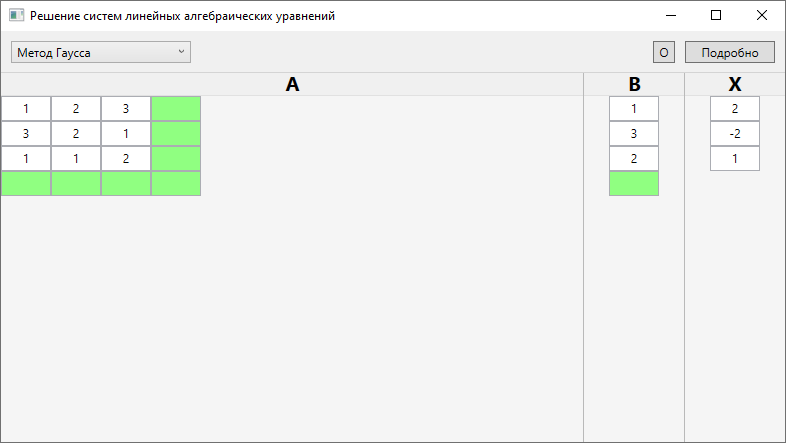
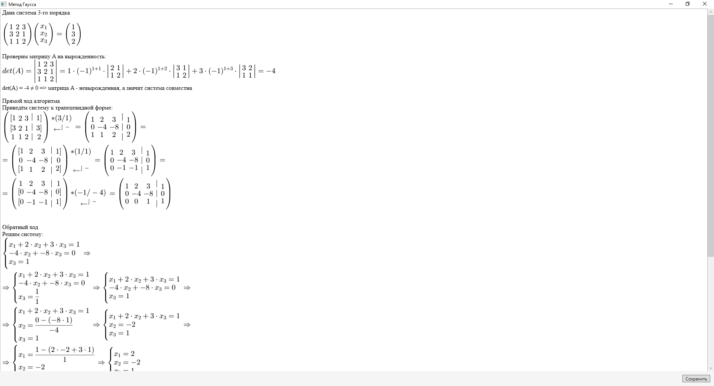
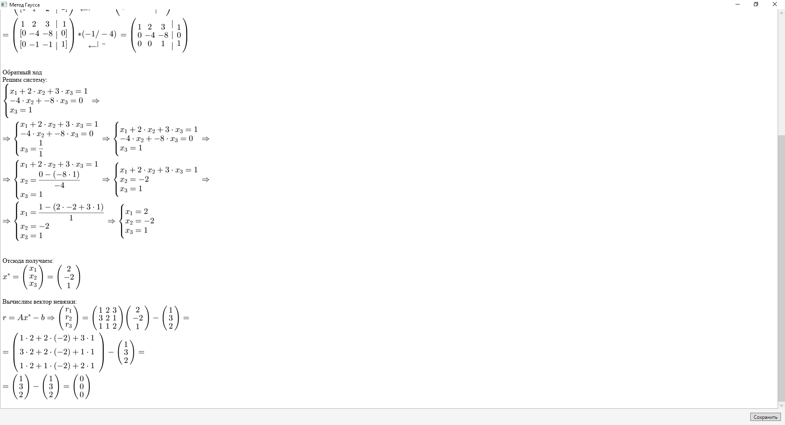

# SystemOfLinearEquations
Решение системы линейных уравнений и генерация отчета: методом Гаусса, методом Гаусса-Жордана, методом LU-разложения

Отчет генерируется с помощью библиотеки WpfMath, с помощью рендеринга LaTeX-формул    
Имеется возможность сохранить отчет в формате \*.rtf для дальнейшей работы в офисных программах

## Пример
    
    
    
